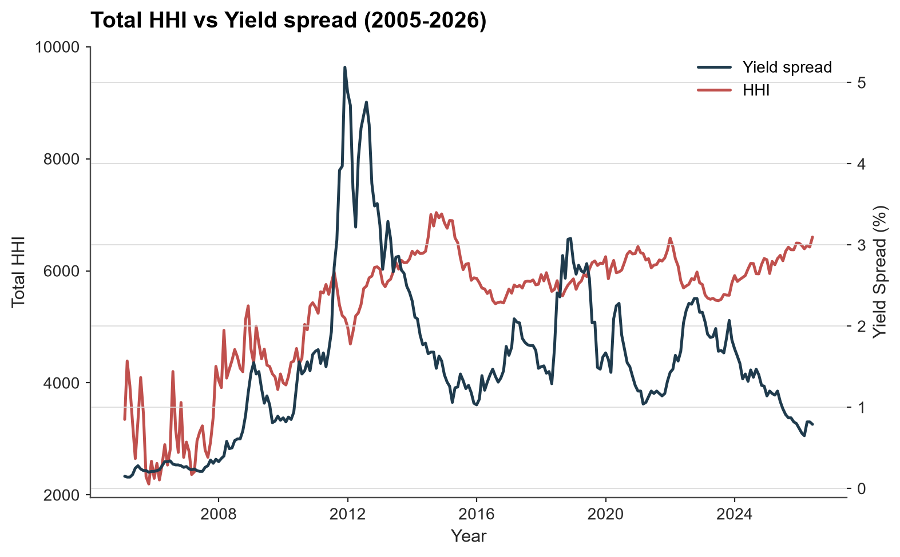
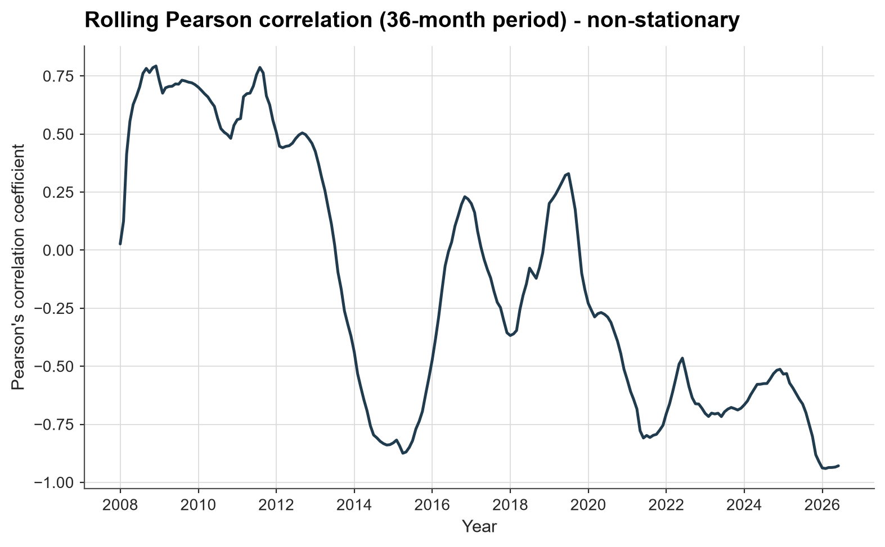
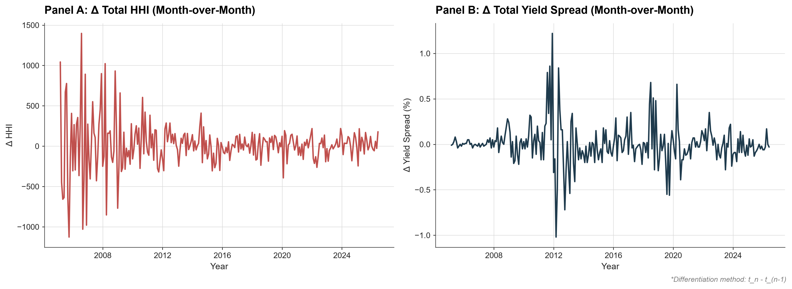
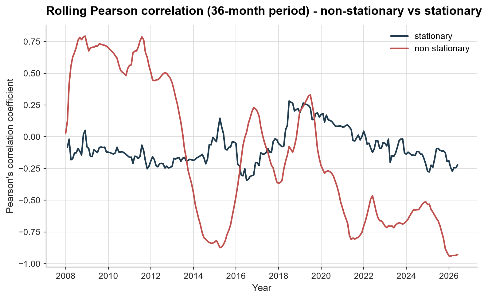

# TARGET2 Liquidity Concentration & Sovereign Bond Spreads

An econometric time series analysis examining the relationship between Eurosystem interbank liquidity concentration ($HHI$) and Eurozone sovereign credit risk (Italian vs. German bond yield spreads) from 2005 to 2026.

This project demonstrates the critical importance of stationarity testing in financial econometric modeling, contrasting spurious correlation found in raw time series levels against markedly weaker relationship in first-differenced series.

---

## Context & Motivation
Inspired by *Manganelli & Wolswijk (2007)* on the drivers of Eurozone sovereign yield spreads, this project tests whether quantity-based payment system concentration, measured via a Herfindahl-Hirschman Index ($HHI$) of TARGET2 balances, co-moves with sovereign debt stress.

  

Note: dual-axis scaling is chosen for visual clarity and does not itself imply statistical correlation - see stationarity analysis below.

---

When analyzing raw level data, a naive approach suggests strong, dynamic co-movement:

  

* Rolling correlation peaks above +0.75 and swings down below -0.80.

However, formal econometric testing reveals this relationship to be spurious, and appears to be driven by shared trends rather than underlying short-term co-movement.

---

## Econometric Methodology

### 1. Unit Root & Stationarity Testing
To evaluate whether the series contain unit roots, both raw and first-differenced series were subjected to Augmented Dickey-Fuller (ADF) and Kwiatkowski-Phillips-Schmidt-Shin (KPSS) tests.

| Variable | Transformation | ADF Stat | ADF p-val | ADF 5% CV | KPSS Stat | KPSS p-val | KPSS 5% CV | Decision |
| :--- | :--- | :---: | :---: | :---: | :---: | :---: | :---: | :---: |
| **Total HHI** | Raw Levels $I(1)$ | -2.2536 | 0.1874 | -2.8736 | 1.5552 | 0.0100 | 0.4630 | Non-Stationary |
| **Yield Spread** | Raw Levels $I(1)$ | -2.5292 | 0.1085 | -2.8736 | 0.3811 | 0.0853 | 0.4630 | Non-Stationary (borderline) |
| **Total HHI** | First Diff $\Delta I(0)$ | -5.0468 | 0.0000 | -2.8736 | 0.0793 | 0.1000 | 0.4630 | **Stationary** |
| **Yield Spread** | First Diff $\Delta I(0)$ | -8.8975 | 0.0000 | -2.8736 | 0.1297 | 0.1000 | 0.4630 | **Stationary** |

* **Raw Levels ($I(1)$):** Non-stationary. Both series exhibit strong structural trends over time.
* **First Differences ($I(0)$):** Stationary. Month-over-month transformations ($\Delta Y_t = Y_t - Y_{t-1}$) eliminate the unit roots.

Isolating month-over-month changes shows the same 2011–2012 stress episode visible in both series, alongside markedly reduced volatility in later years.

  

---

### 2. Rolling Pearson Correlation
A 36-month rolling window Pearson correlation coefficient was calculated for both:
1. Raw, non-stationary level series.
2. Stationary, first-differenced series.

---

## Key Findings

### Spurious Correlation vs. True Signals
Transforming the series to stationary processes causes the rolling correlation to weaken substantially, with the differenced relationship peaking around ±0.3 - modest, and of borderline statistical significance at this sample size - compared to the ±0.75/−0.80 swings seen in raw levels.

  

---

#### Footnotes
1. The differenced series shows clear heteroskedasticity (volatility clusters around 2011–2012 and pre-2010), suggesting the relationship may be regime-dependent; this was not further decomposed due to project scope.
2. AI-Usage: AI was used to print the table in the terminal, write regex for column renaming as well as to help with the creation of econ_style.mplstyle file and creating this README :)
